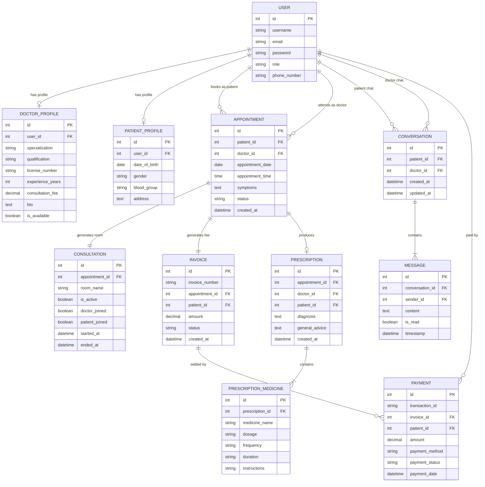

# Entity Relationship (ER) Diagram
## CareConnect360 Database Design

```mermaid
erDiagram
    USER ||--o| DOCTOR_PROFILE : "has profile"
    USER ||--o| PATIENT_PROFILE : "has profile"
    USER ||--o{ APPOINTMENT : "books as patient"
    USER ||--o{ APPOINTMENT : "attends as doctor"
    APPOINTMENT ||--|| CONSULTATION : "generates room"
    APPOINTMENT ||--|| INVOICE : "generates fee"
    APPOINTMENT ||--o| PRESCRIPTION : "produces"
    PRESCRIPTION ||--|{ PRESCRIPTION_MEDICINE : "contains"
    USER ||--o{ CONVERSATION : "patient chat"
    USER ||--o{ CONVERSATION : "doctor chat"
    CONVERSATION ||--|{ MESSAGE : "contains"
    INVOICE ||--o{ PAYMENT : "settled by"
    USER ||--o{ PAYMENT : "paid by"

    USER {
        int id PK
        string username
        string email
        string password
        string role
        string phone_number
    }

    DOCTOR_PROFILE {
        int id PK
        int user_id FK
        string specialization
        string qualification
        string license_number
        int experience_years
        decimal consultation_fee
        text bio
        boolean is_available
    }

    PATIENT_PROFILE {
        int id PK
        int user_id FK
        date date_of_birth
        string gender
        string blood_group
        text address
    }

    APPOINTMENT {
        int id PK
        int patient_id FK
        int doctor_id FK
        date appointment_date
        time appointment_time
        text symptoms
        string status
        datetime created_at
    }

    CONSULTATION {
        int id PK
        int appointment_id FK
        string room_name
        boolean is_active
        boolean doctor_joined
        boolean patient_joined
        datetime started_at
        datetime ended_at
    }

    PRESCRIPTION {
        int id PK
        int appointment_id FK
        int doctor_id FK
        int patient_id FK
        text diagnosis
        text general_advice
        datetime created_at
    }

    PRESCRIPTION_MEDICINE {
        int id PK
        int prescription_id FK
        string medicine_name
        string dosage
        string frequency
        string duration
        string instructions
    }

    CONVERSATION {
        int id PK
        int patient_id FK
        int doctor_id FK
        datetime created_at
        datetime updated_at
    }

    MESSAGE {
        int id PK
        int conversation_id FK
        int sender_id FK
        text content
        boolean is_read
        datetime timestamp
    }

    INVOICE {
        int id PK
        string invoice_number
        int appointment_id FK
        int patient_id FK
        decimal amount
        string status
        datetime created_at
    }

    PAYMENT {
        int id PK
        string transaction_id
        int invoice_id FK
        int patient_id FK
        decimal amount
        string payment_method
        string payment_status
        datetime payment_date
    }
```
